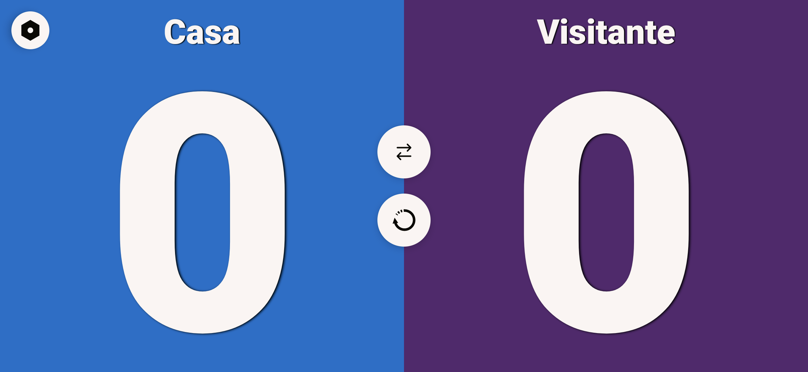
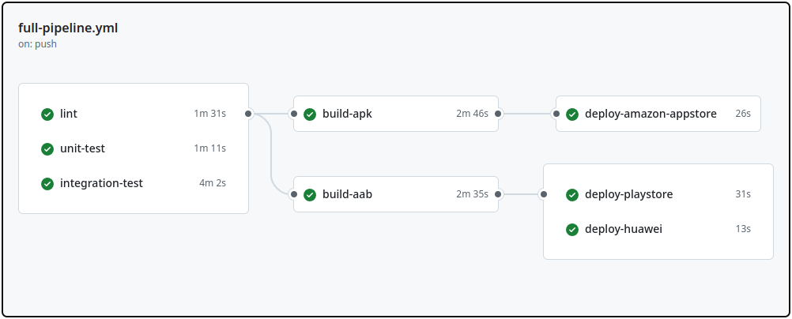

# Scoreboard Lite

Scoreboard Android App using kotlin + MVVM, Material3, Data Binding, Live Data, Datastore, Coroutines, DaggerHilt, Firebase(Analytics, Crashlytics, RemoteConfig, Performance), AdMob, Navigation UI, local tests - JUnit, instrumented tests - Espresso and CI/CD with CircleCI + Gradle Play Plugin(GPP)

## Table of Contents

- [Screenshots](#screenshots)
- [Features](#features)
- [Download](#download)
- [License](#license)
- [Contact](#contact)

## Screenshots
### App

### CI/CD Pipeline

## Features

- A practical and lightweight app for keeping track of game scores!
- Click to increase points and drag up to down to decrease
- Customize your points: You can set how many points to add per click, making it perfect for various types of games.
- Set the winning score: Choose the target score and easily track who’s in the lead.
- Accessibility is one of the priorities, please give a feedback in case you need additional features

## Download

Get the app from the following stores:

## License

This project is licensed under the MIT License - see the [LICENSE](LICENSE) file for details.

## Contact

If you have any questions or feedback, feel free to contact me at [brunoguimaraes.dev@gmail.com].
