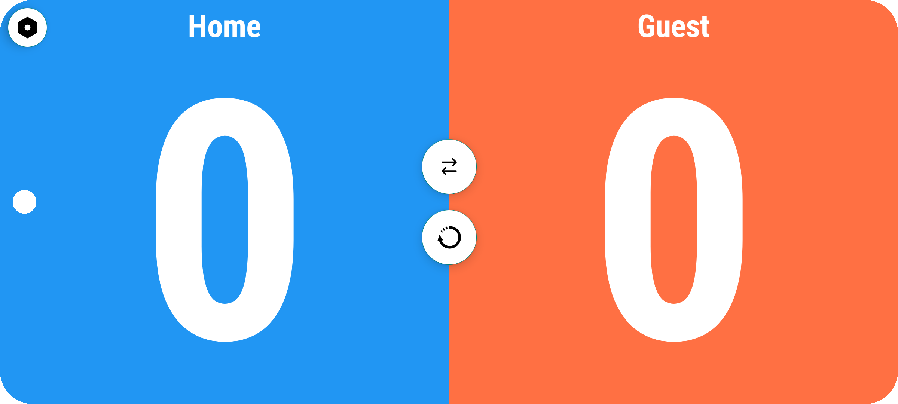

# Scoreboard Android App
### Main Technologies
Kotlin, MVVM, Datastore, Coroutines, DaggerHilt, AdMob, Navigation UI.

### Features 
Flip score, Reset score, Drag to decrease values, Set points to win and Set points on tap.

### Screenshots

